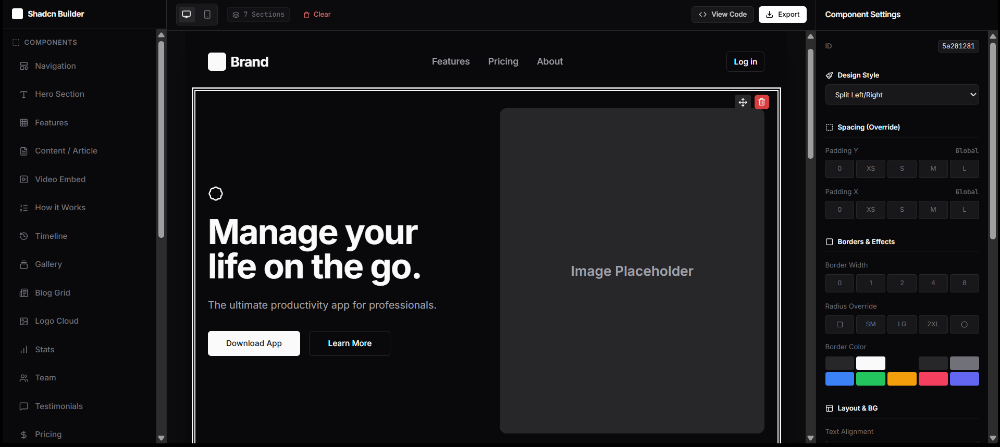

# 🚀 Shadcn Visual Builder

**A developer-first, drag-and-drop landing page builder generating clean React + Tailwind code.**

This tool allows you to visually construct landing pages using pre-built, accessible components designed with the **Shadcn UI** aesthetic. It provides a real-time preview, extensive customization options, and generates production-ready code that you can copy and paste directly into your Next.js or React projects.


*(Replace this link with an actual screenshot of your app)*

---

## ✨ Features

### 🏗️ Visual Editor
*   **Drag & Drop Interface:** Powered by `@dnd-kit` for smooth sorting and placement.
*   **Component Library:** Over 15+ sections including Heroes, Features, Pricing, Testimonials, Videos, and Banners.
*   **Templates:** Pre-built templates for SaaS, Agency, Mobile Apps, and Online Courses.
*   **Responsive Preview:** Toggle between Desktop and Mobile views instantly.

### 🎨 Design System & Customization
*   **Global Theming:** Switch between preset color themes (Zinc, Blue, Rose, Green, Orange).
*   **Fine-Grained Spacing:** Control global vertical padding (Y), horizontal padding (X), and section gaps.
*   **Dark/Light Mode:** Toggle the entire builder and preview in real-time.
*   **Border Radius Control:** Adjust the roundness of buttons and cards globally.
*   **Component Variants:** Change the layout of individual components (e.g., Hero Split vs. Hero Glow) with a single click.

### ⚡ Developer Experience
*   **Live Code Generation:** Instantly generates the React code for your layout.
*   **Clean Output:** The generated code uses standard Tailwind CSS classes and assumes standard Shadcn UI components (`Button`, `Card`, `Input`, etc.).
*   **Export:** Download the `.tsx` file ready for your project.

---

## 🛠️ Tech Stack

*   **Framework:** [React 19](https://react.dev/)
*   **Language:** [TypeScript](https://www.typescriptlang.org/)
*   **Styling:** [Tailwind CSS](https://tailwindcss.com/)
*   **Drag & Drop:** [@dnd-kit](https://dndkit.com/)
*   **Icons:** [Lucide React](https://lucide.dev/)
*   **Utilities:** `clsx`, `tailwind-merge`

---

## 📦 Components Included

The builder includes a rich set of components, each with multiple design variants:

| Component | Description | Variants |
| :--- | :--- | :--- |
| **Hero** | Main landing section | Centered, Split, Glow Effect |
| **Feature Grid** | Grid of features | Simple Grid, Cards, List View |
| **Video** | Video embeds | Browser Frame, Rounded Plain, Full Width |
| **Stats** | Statistical numbers | Simple Text, Boxed Cards, Split Background |
| **Testimonial** | User reviews | Grid Cards, Minimal, Large Centered |
| **Pricing** | Pricing tables | Standard Cards (with "Popular" toggle) |
| **CTA** | Call to Action | Centered Box, Split, Minimal Link |
| **Contact** | Contact forms | Centered Form, Split Info/Form |
| **Team** | Team members | Grid Cards, Horizontal List |
| **Banner** | Announcement bars | Slim Strip, Info Box |
| **Content** | Text/Article sections | Centered Prose, Text + Image |
| **Others** | Nav, Footer, FAQ, Steps, Timeline, Gallery, Logo Cloud, Newsletter | Standard layouts |

---

## 🚀 Getting Started

To run this project locally, follow these steps:

### Prerequisites
*   Node.js (v18 or higher)
*   npm or yarn

### Installation

1.  **Clone the repository:**
    ```bash
    git clone https://github.com/your-username/shadcn-visual-builder.git
    cd shadcn-visual-builder
    ```

2.  **Install dependencies:**
    *(Note: Since this is currently a standalone file structure, if you are moving it to a Vite environment)*
    ```bash
    npm install
    # or
    yarn install
    ```

3.  **Run the development server:**
    ```bash
    npm run dev
    ```

4.  **Open in Browser:**
    Navigate to `http://localhost:5173` (or the port shown in your terminal).

---

## 📖 Usage Guide

1.  **Select Components:** Open the **Sidebar (Left)**. You can drag individual components or entire templates onto the canvas.
2.  **Edit Properties:** Click on any component on the canvas to open the **Properties Panel (Right)**.
    *   Edit text content, links, and specific props.
    *   Change the **Design Variant** (e.g., switch a Hero from "Centered" to "Split").
    *   Adjust specific spacing or borders for that component.
3.  **Global Settings:** Click on the empty background area (or deselect a component) to view **Global Design Settings**.
    *   Change the Color Theme, Radius, Padding X/Y, and Section Gap.
4.  **Export:** Click the **"View Code"** button to copy the source or **"Export"** to download the file.

---

## 📂 Project Structure

```text
src/
├── components/
│   └── PreviewComponents.tsx  # Renders the visual representation of components
├── lib/
│   └── codeGenerator.ts       # Logic to convert state to React code string
├── utils/
│   └── cn.ts                  # Tailwind class merger utility
├── App.tsx                    # Main Application Logic (State, DndContext)
├── constants.ts               # Definitions for Components, Templates, and Themes
├── types.ts                   # TypeScript interfaces
├── index.tsx                  # Entry point
└── index.html                 # HTML shell

```

## Run Locally

**Prerequisites:**  Node.js


1. Install dependencies:
   `npm install`
2. Set the `GEMINI_API_KEY` in [.env.local](.env.local) to your Gemini API key
3. Run the app:
   `npm run dev`
   
...
  
## 🤝 Contributing
Contributions are welcome! Please follow these steps:
Fork the project.
Create your feature branch (git checkout -b feature/AmazingFeature).
Commit your changes (git commit -m 'Add some AmazingFeature').
Push to the branch (git push origin feature/AmazingFeature).
Open a Pull Request.
📄 License
Distributed under the MIT License. See LICENSE for more information.
Built with ❤️ for the React Community.
